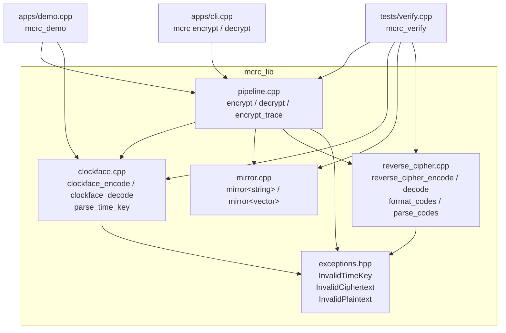
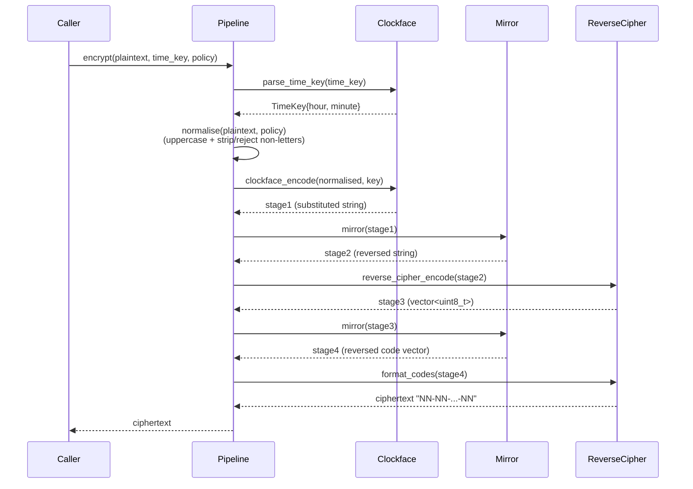
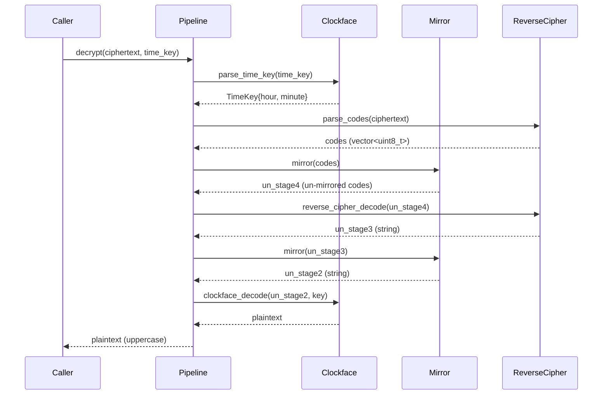

# Design Document: Mirror Clock Reverse Cipher (MCRC)

## Overview

The Mirror Clock Reverse Cipher (MCRC) is a multi-round hybrid encryption algorithm implemented as a 4-stage pipeline in C++20. It combines a clockface-based letter substitution, two mirror (reversal) permutations, and a reverse-alphabet numeric encoding to produce a dash-separated numeric ciphertext. The implementation lives in the `mcrc` namespace across a static library (`mcrc_lib`), a CLI tool (`mcrc`), a demo tool (`mcrc_demo`), and a verification suite (`mcrc_verify`).

---

## Architecture



### Build System

The project uses CMake 3.20+ with C++20. All warnings are treated as errors (`-Wall -Wextra -Wpedantic -Werror`). The `verify` CMake target runs `mcrc_verify` as a post-build check.

---

## Sequence Diagrams

### Encryption Flow



### Decryption Flow



---

## Components and Interfaces

### Component 1: Clockface (`clockface.hpp` / `clockface.cpp`)

**Purpose**: Implements Stage 1 of the MCRC pipeline — a letter-to-letter substitution based on a dual-ring analog clock layout. Also owns time key parsing.

**Interface**:
```cpp
namespace mcrc {

struct TimeKey {
    std::uint8_t hour;   // 1–12 inclusive
    std::uint8_t minute; // 0–59 inclusive
};

TimeKey parse_time_key(std::string_view text);

std::string clockface_encode(std::string_view letters, const TimeKey& key);
std::string clockface_decode(std::string_view letters, const TimeKey& key);

} // namespace mcrc
```

**Responsibilities**:
- Parse and validate time keys in `H:MM` or `HH:MM` format
- Apply the ROT13-over-24-letters swap table (A↔N, B↔O, …, L↔Y; M and Z fixed)
- Both `clockface_encode` and `clockface_decode` apply the same involution table
- The `TimeKey` is accepted but not mixed into the substitution in v1

**Swap Table Logic** (compile-time `constexpr`):
- Letters A–L (inner ring, clock positions 1–12) map to N–Y (outer ring) by adding 13
- Letters N–Y (outer ring) map to A–L (inner ring) by subtracting 13
- M and Z map to themselves (centre position)

### Component 2: Mirror (`mirror.hpp` / `mirror.cpp`)

**Purpose**: Implements Stages 2 and 4 — reversal of a character sequence or a numeric code sequence.

**Interface**:
```cpp
namespace mcrc {

std::string mirror(std::string_view input);
std::vector<std::uint8_t> mirror(const std::vector<std::uint8_t>& pairs);

} // namespace mcrc
```

**Responsibilities**:
- Reverse the character order of a string (Stage 2)
- Reverse the element order of a `vector<uint8_t>` (Stage 4)
- Both overloads are pure functions with no side effects

### Component 3: Reverse Cipher (`reverse_cipher.hpp` / `reverse_cipher.cpp`)

**Purpose**: Implements Stage 3 — maps each letter to a two-digit numeric code using the formula `code = 25 - (letter - 'A')`.

**Interface**:
```cpp
namespace mcrc {

inline constexpr std::array<std::uint8_t, 26> kReverseCipherTable; // A=25, B=24, ..., Z=0

std::vector<std::uint8_t> reverse_cipher_encode(std::string_view letters);
std::string reverse_cipher_decode(const std::vector<std::uint8_t>& codes);
std::string format_codes(const std::vector<std::uint8_t>& codes);
std::vector<std::uint8_t> parse_codes(std::string_view ciphertext);

} // namespace mcrc
```

**Responsibilities**:
- `kReverseCipherTable`: compile-time constant array; `table[i] = 25 - i`
- `reverse_cipher_encode`: converts each uppercase letter to its code; throws `InvalidPlaintext` on non-letter input
- `reverse_cipher_decode`: converts each code back to a letter via `'A' + (25 - code)`; throws `InvalidCiphertext` if any code > 25
- `format_codes`: serialises a code vector to `"NN-NN-...-NN"` with zero-padding; output length is `codes.size() * 3 - 1` for non-empty input
- `parse_codes`: deserialises ciphertext; validates digit pairs, range [0,25], dash separators, no trailing dash

### Component 4: Pipeline (`pipeline.hpp` / `pipeline.cpp`)

**Purpose**: Orchestrates the full 4-stage MCRC pipeline for encryption and decryption.

**Interface**:
```cpp
namespace mcrc {

enum class NonLetterPolicy { Strip, Reject };

std::string encrypt(std::string_view plaintext,
                    std::string_view time_key,
                    NonLetterPolicy policy = NonLetterPolicy::Strip);

std::string decrypt(std::string_view ciphertext, std::string_view time_key);

struct PipelineTrace {
    std::string normalised;
    std::string after_clockface;
    std::string after_first_mirror;
    std::string after_reverse_cipher;
    std::string after_second_mirror;
};

PipelineTrace encrypt_trace(std::string_view plaintext,
                            std::string_view time_key,
                            NonLetterPolicy policy = NonLetterPolicy::Strip);

} // namespace mcrc
```

**Responsibilities**:
- `normalise`: uppercases input and either strips or rejects non-letter characters
- `encrypt`: normalise → clockface_encode → mirror → reverse_cipher_encode → mirror → format_codes
- `decrypt`: parse_codes → mirror → reverse_cipher_decode → mirror → clockface_decode
- `encrypt_trace`: same as `encrypt` but captures and returns all intermediate stage outputs

### Component 5: Exceptions (`exceptions.hpp`)

**Purpose**: Defines the three domain exception types used throughout the library.

**Interface**:
```cpp
namespace mcrc {

class InvalidTimeKey    : public std::runtime_error { ... };
class InvalidCiphertext : public std::runtime_error { ... };
class InvalidPlaintext  : public std::runtime_error { ... };

} // namespace mcrc
```

**Responsibilities**:
- `InvalidTimeKey`: thrown by `parse_time_key` on format or range violations
- `InvalidCiphertext`: thrown by `parse_codes` and `reverse_cipher_decode` on malformed or out-of-range input
- `InvalidPlaintext`: thrown by `clockface_encode`, `reverse_cipher_encode`, and `normalise` (under Reject policy) on non-letter characters

### Component 6: CLI (`apps/cli.cpp`)

**Purpose**: Command-line interface exposing `encrypt` and `decrypt` subcommands.

**Usage**:
```
mcrc encrypt --key <H:MM> --text <PLAINTEXT> [--reject]
mcrc decrypt --key <H:MM> --cipher <NN-NN-...>
```

**Exit Codes**:
- `0`: success
- `1`: usage error or unknown flag
- `2`: `InvalidTimeKey`
- `3`: `InvalidCiphertext`
- `4`: `InvalidPlaintext`

### Component 7: Demo (`apps/demo.cpp`)

**Purpose**: Interactive demonstration tool that renders an ASCII analog clock and prints the full pipeline trace.

**Usage**:
```
mcrc_demo --key <H:MM> --text <PLAINTEXT> [--no-clock]
```

**Responsibilities**:
- Render an 11×23 ASCII clock grid with hour (`H`) and minute (`M`) hand markers
- Print all five pipeline stages: normalised input, after clockface, after first mirror, after reverse cipher, after second mirror

---

## Data Models

### TimeKey

```cpp
struct TimeKey {
    std::uint8_t hour;   // range: [1, 12]
    std::uint8_t minute; // range: [0, 59]
};
```

**Validation Rules**:
- Hour must be 1–2 digits, value in [1, 12]
- Minute must be exactly 2 digits, value in [0, 59]
- Separator must be `:`
- All characters must be ASCII digits

### Ciphertext Format

A valid MCRC ciphertext is a non-empty sequence of dash-separated two-digit decimal groups:

```
ciphertext ::= group ('-' group)*
group      ::= digit digit
digit      ::= '0' | '1' | ... | '9'
```

**Validation Rules**:
- Each group must be exactly 2 decimal digits
- Each group value must be in [0, 25]
- Groups are separated by exactly one `-`
- No leading or trailing `-`
- Empty string is valid (represents empty plaintext)

---

## Algorithmic Pseudocode

### Main Encryption Algorithm

```pascal
ALGORITHM encrypt(plaintext, time_key, policy)
INPUT:  plaintext of type string
        time_key  of type string (H:MM format)
        policy    of type NonLetterPolicy (Strip | Reject)
OUTPUT: ciphertext of type string

BEGIN
  key ← parse_time_key(time_key)
  ASSERT key.hour IN [1, 12] AND key.minute IN [0, 59]

  normalised ← ""
  FOR each char c IN plaintext DO
    uc ← to_upper(c)
    IF uc IN ['A'..'Z'] THEN
      normalised ← normalised + uc
    ELSE IF policy = Reject THEN
      THROW InvalidPlaintext
    END IF
  END FOR

  // Stage 1: Clockface substitution
  stage1 ← clockface_encode(normalised, key)
  ASSERT length(stage1) = length(normalised)

  // Stage 2: Mirror permutation
  stage2 ← reverse(stage1)
  ASSERT length(stage2) = length(stage1)

  // Stage 3: Reverse cipher encoding
  stage3 ← []
  FOR each char c IN stage2 DO
    stage3.append(25 - (c - 'A'))
  END FOR
  ASSERT length(stage3) = length(stage2)

  // Stage 4: Mirror permutation on codes
  stage4 ← reverse(stage3)
  ASSERT length(stage4) = length(stage3)

  RETURN format_codes(stage4)
END
```

**Preconditions**:
- `time_key` is a non-empty string in `H:MM` or `HH:MM` format
- `plaintext` may contain any characters; non-letters are handled per `policy`

**Postconditions**:
- Output is a valid MCRC ciphertext string (or empty string for empty normalised input)
- `length(output_groups) = length(normalised_plaintext)`
- `decrypt(encrypt(p, k), k) = normalise(p)` for all valid inputs

**Loop Invariants**:
- Normalisation loop: all characters appended to `normalised` are uppercase A–Z
- Stage 3 loop: all codes appended are in [0, 25]

### Clockface Swap Algorithm

```pascal
ALGORITHM clockface_encode(letters, key)
INPUT:  letters of type string (uppercase A-Z only)
        key     of type TimeKey (unused in v1)
OUTPUT: substituted of type string

BEGIN
  substituted ← ""
  FOR each char c IN letters DO
    IF c NOT IN ['A'..'Z'] THEN
      THROW InvalidPlaintext
    END IF

    IF c = 'M' OR c = 'Z' THEN
      substituted ← substituted + c          // centre: fixed point
    ELSE IF c IN ['A'..'L'] THEN
      substituted ← substituted + char(c + 13)  // inner → outer
    ELSE  // c IN ['N'..'Y']
      substituted ← substituted + char(c - 13)  // outer → inner
    END IF
  END FOR
  RETURN substituted
END
```

**Preconditions**:
- All characters in `letters` are uppercase A–Z

**Postconditions**:
- `length(output) = length(letters)`
- `clockface_encode(clockface_encode(s, k), k) = s` for all s, k (involution)
- `clockface_decode = clockface_encode` (same swap table)

**Loop Invariants**:
- Every character appended to `substituted` is an uppercase A–Z letter

### Decryption Algorithm

```pascal
ALGORITHM decrypt(ciphertext, time_key)
INPUT:  ciphertext of type string (NN-NN-... format)
        time_key   of type string
OUTPUT: plaintext  of type string (uppercase)

BEGIN
  key   ← parse_time_key(time_key)
  codes ← parse_codes(ciphertext)

  // Undo Stage 4
  un4 ← reverse(codes)

  // Undo Stage 3
  un3 ← ""
  FOR each code v IN un4 DO
    IF v > 25 THEN THROW InvalidCiphertext END IF
    un3 ← un3 + char('A' + (25 - v))
  END FOR

  // Undo Stage 2
  un2 ← reverse(un3)

  // Undo Stage 1
  RETURN clockface_decode(un2, key)
END
```

**Preconditions**:
- `ciphertext` is a valid MCRC ciphertext (or empty string)
- `time_key` is the same key used during encryption

**Postconditions**:
- Output is an uppercase A–Z string
- `decrypt(encrypt(p, k), k) = normalise(p)`

---

## Key Functions with Formal Specifications

### `parse_time_key`

```cpp
TimeKey parse_time_key(std::string_view text);
```

**Preconditions**:
- `text` is a non-empty string

**Postconditions**:
- Returns `TimeKey` with `hour ∈ [1,12]` and `minute ∈ [0,59]`
- Throws `InvalidTimeKey` if: empty, no colon, hour not 1–2 digits, minute not exactly 2 digits, any non-digit character, hour outside [1,12], minute outside [0,59]

### `clockface_encode` / `clockface_decode`

```cpp
std::string clockface_encode(std::string_view letters, const TimeKey& key);
std::string clockface_decode(std::string_view letters, const TimeKey& key);
```

**Preconditions**:
- All characters in `letters` are uppercase A–Z

**Postconditions**:
- `|output| = |input|`
- `clockface_encode(clockface_encode(s, k), k) = s` (involution)
- `clockface_decode(clockface_encode(s, k), k) = s`
- For all valid keys k1, k2: `clockface_encode(s, k1) = clockface_encode(s, k2)` (v1: key unused)

### `reverse_cipher_encode`

```cpp
std::vector<std::uint8_t> reverse_cipher_encode(std::string_view letters);
```

**Preconditions**:
- All characters in `letters` are uppercase A–Z

**Postconditions**:
- `output.size() = letters.size()`
- `output[i] = 25 - (letters[i] - 'A')` for all i
- All output values are in [0, 25]
- Throws `InvalidPlaintext` on any non-letter character

### `reverse_cipher_decode`

```cpp
std::string reverse_cipher_decode(const std::vector<std::uint8_t>& codes);
```

**Preconditions**:
- All values in `codes` are in [0, 25]

**Postconditions**:
- `output.size() = codes.size()`
- `output[i] = 'A' + (25 - codes[i])` for all i
- `reverse_cipher_decode(reverse_cipher_encode(s)) = s`
- Throws `InvalidCiphertext` if any code > 25

### `format_codes` / `parse_codes`

```cpp
std::string format_codes(const std::vector<std::uint8_t>& codes);
std::vector<std::uint8_t> parse_codes(std::string_view ciphertext);
```

**Postconditions** (`format_codes`):
- Empty input → empty string
- Non-empty input → string of length `codes.size() * 3 - 1`
- Each group is zero-padded to exactly 2 digits
- Groups are separated by exactly one `-`

**Postconditions** (`parse_codes`):
- `parse_codes(format_codes(v)) = v` for all valid code vectors
- Throws `InvalidCiphertext` on: truncated group, non-digit characters, value > 25, missing separator, trailing `-`

### `encrypt` / `decrypt`

```cpp
std::string encrypt(std::string_view plaintext, std::string_view time_key,
                    NonLetterPolicy policy = NonLetterPolicy::Strip);
std::string decrypt(std::string_view ciphertext, std::string_view time_key);
```

**Postconditions**:
- `decrypt(encrypt(p, k), k) = normalise(p)` for all valid p, k
- `encrypt("", k) = ""`
- `decrypt("", k) = ""`
- Number of dash-separated groups in output equals length of normalised plaintext

---

## Correctness Properties

These properties are suitable for property-based testing (e.g., with a C++ PBT library such as RapidCheck or a hand-rolled generator as in `verify_random_roundtrip`).

### P1 — Clockface Involution
For all uppercase strings `s` and valid keys `k`:
```
clockface_encode(clockface_encode(s, k), k) == s
```

**Validates: Requirement 1.2**

### P2 — Clockface Key Independence (v1)
For all uppercase strings `s` and all valid keys `k1`, `k2`:
```
clockface_encode(s, k1) == clockface_encode(s, k2)
```

**Validates: Requirement 1.3**

### P3 — Mirror Involution (string)
For all strings `s`:
```
mirror(mirror(s)) == s
```

**Validates: Requirement 2.2**

### P4 — Mirror Involution (vector)
For all `vector<uint8_t>` `v`:
```
mirror(mirror(v)) == v
```

**Validates: Requirement 2.3**

### P5 — Reverse Cipher Table Formula
For all `i` in [0, 25]:
```
kReverseCipherTable[i] == 25 - i
```

**Validates: Requirement 3.1**

### P6 — Reverse Cipher Encode/Decode Roundtrip
For all uppercase strings `s`:
```
reverse_cipher_decode(reverse_cipher_encode(s)) == s
```

**Validates: Requirement 3.2**

### P7 — Reverse Cipher Code Range
For all uppercase strings `s`, all codes in `reverse_cipher_encode(s)` are in [0, 25].

**Validates: Requirement 3.3**

### P8 — format_codes / parse_codes Roundtrip
For all valid code vectors `v` (values in [0, 25]):
```
parse_codes(format_codes(v)) == v
```

**Validates: Requirement 4.3**

### P9 — format_codes Output Length
For all non-empty code vectors `v`:
```
format_codes(v).size() == v.size() * 3 - 1
```

**Validates: Requirement 4.2**

### P10 — Full Encrypt/Decrypt Roundtrip
For all uppercase strings `p` and valid time keys `k`:
```
decrypt(encrypt(p, k), k) == p
```

**Validates: Requirement 7.5**

### P11 — Ciphertext Group Count Equals Plaintext Length
For all uppercase strings `p` and valid keys `k`:
```
count_groups(encrypt(p, k)) == p.size()
```
where `count_groups` counts dash-separated tokens.

**Validates: Requirement 6.8**

### P12 — Strip Policy Idempotence
For all strings `p` and valid keys `k`:
```
encrypt(p, k, Strip) == encrypt(normalise(p), k, Strip)
```

**Validates: Requirement 6.3**

### P13 — Empty Input Identity
For all valid keys `k`:
```
encrypt("", k) == ""
decrypt("", k) == ""
```

**Validates: Requirements 6.5, 7.2**

---

## Error Handling

### InvalidTimeKey

**Condition**: `parse_time_key` receives a string that is empty, missing the `:` separator, has a non-digit character, has hour outside [1,12], has minute not exactly 2 digits, or has minute outside [0,59].

**Response**: Throws `InvalidTimeKey` with a descriptive message prefixed `"InvalidTimeKey: "`.

**Recovery**: Caller catches and reports the error. CLI exits with code 2.

### InvalidCiphertext

**Condition**: `parse_codes` or `reverse_cipher_decode` receives malformed input — truncated groups, non-digit characters, values > 25, missing separators, or trailing dashes.

**Response**: Throws `InvalidCiphertext` with a descriptive message prefixed `"InvalidCiphertext: "`.

**Recovery**: Caller catches and reports the error. CLI exits with code 3.

### InvalidPlaintext

**Condition**: `clockface_encode` or `reverse_cipher_encode` receives a non-letter character, or `normalise` is called with `NonLetterPolicy::Reject` and the input contains a non-letter.

**Response**: Throws `InvalidPlaintext` with a descriptive message prefixed `"InvalidPlaintext: "`.

**Recovery**: Caller catches and reports the error. CLI exits with code 4.

---

## Testing Strategy

### Unit Testing Approach

The existing `tests/verify.cpp` uses `assert()`-based checks compiled with NDEBUG disabled. Each component has a dedicated verification function:

- `verify_reverse_cipher_table()` — spot-checks the compile-time table
- `verify_mirror_layer()` — checks string and vector reversal, involution property
- `verify_reverse_cipher_roundtrip()` — encode/decode roundtrip, format/parse roundtrip
- `verify_clockface_layer()` — ROT13 pairs, M/Z fixed points, involution, key independence
- `verify_time_key_parsing()` — valid formats, all invalid format categories
- `verify_ciphertext_parsing_errors()` — all malformed ciphertext categories
- `verify_integration()` — known-answer test, normalisation, Reject policy, empty input
- `verify_random_roundtrip()` — 100 random uppercase strings × random valid keys

### Property-Based Testing Approach

**Property Test Library**: RapidCheck (C++) or a hand-rolled generator (as currently used in `verify_random_roundtrip`).

Key properties to cover (see Correctness Properties section):
- P1: Clockface involution over all 26 letters
- P3/P4: Mirror involution over arbitrary strings and code vectors
- P6: Reverse cipher encode/decode roundtrip over arbitrary uppercase strings
- P8: format_codes/parse_codes roundtrip over arbitrary valid code vectors
- P10: Full encrypt/decrypt roundtrip over arbitrary uppercase strings and valid keys
- P12: Strip policy idempotence

### Integration Testing Approach

- CLI binary: `mcrc encrypt --key 3:20 --text QUEEN` should output `22-18-08-08-25`
- CLI binary: `mcrc decrypt --key 3:20 --cipher 22-18-08-08-25` should output `QUEEN`
- CLI exit codes: verify codes 2, 3, 4 for each exception type
- Demo binary: `mcrc_demo --key 3:20 --text QUEEN` should print all 5 pipeline stages without error

---

## Resolved: Spec Document vs. Implementation (corrected in v1.0)

The original MCRC specification document had an incorrect clockface result (Q mapped to E instead of D).

The correct v1.0 pipeline (pure ROT13 clockface substitution):

```
QUEEN → DHRRA  (clockface stage)  ← CORRECT
```

**Root cause**: The spec document's dual-ring layout describes a ROT13-over-24-letters substitution (A↔N, B↔O, …, L↔Y; M and Z fixed). The letter Q is at clock position 4 on the outer ring and maps to D (inner ring, position 4). The spec example showing Q→E was incorrect — E is at clock position 5, not position 4.

**Resolution**: Corrected in the v1.0 release. The README, code, and verify suite all use the correct mapping. Full pipeline trace:

```
QUEEN
 → DHRRA              (clockface substitution, pure ROT13)
 → ARRHD              (first mirror permutation)
 → 25-08-08-18-22     (reverse cipher substitution)
 → 22-18-08-08-25     (second mirror permutation — final ciphertext)
```

---

## Performance Considerations

- All pipeline stages operate in O(n) time and O(n) space where n is the plaintext length
- The clockface swap table and reverse cipher table are `constexpr` compile-time constants — no runtime initialisation cost
- `format_codes` pre-reserves output string capacity (`codes.size() * 3 - 1`) to avoid reallocations
- `reverse_cipher_encode` pre-reserves the output vector
- No heap allocation occurs in the hot path beyond the output strings/vectors themselves
- The algorithm is not designed for cryptographic security; it is a pedagogical cipher

---

## Security Considerations

MCRC is **not a cryptographically secure cipher**. It is a pedagogical/puzzle cipher with the following known weaknesses:

- The clockface substitution is a fixed permutation (ROT13 over 24 letters); it provides no key-dependent diffusion in v1
- The time key is validated but not used in the substitution (v1 limitation)
- The reverse cipher is a fixed, publicly known mapping
- The mirror permutations are deterministic and key-independent
- The algorithm is vulnerable to frequency analysis and known-plaintext attacks

The time key field exists to support a future v2 where the key is mixed into the clockface substitution. Until then, any two valid keys produce identical ciphertext for the same plaintext.

---

## Dependencies

| Dependency | Version | Purpose |
|---|---|---|
| C++ Standard Library | C++20 | `std::string`, `std::vector`, `std::array`, `std::string_view`, `std::runtime_error`, `<cstdint>`, `<cctype>`, `<algorithm>` |
| CMake | ≥ 3.20 | Build system |
| No external libraries | — | The library has zero runtime dependencies beyond the C++ standard library |

The verification suite (`tests/verify.cpp`) uses `<random>` and `<cassert>` from the standard library only. No third-party testing framework is required.
